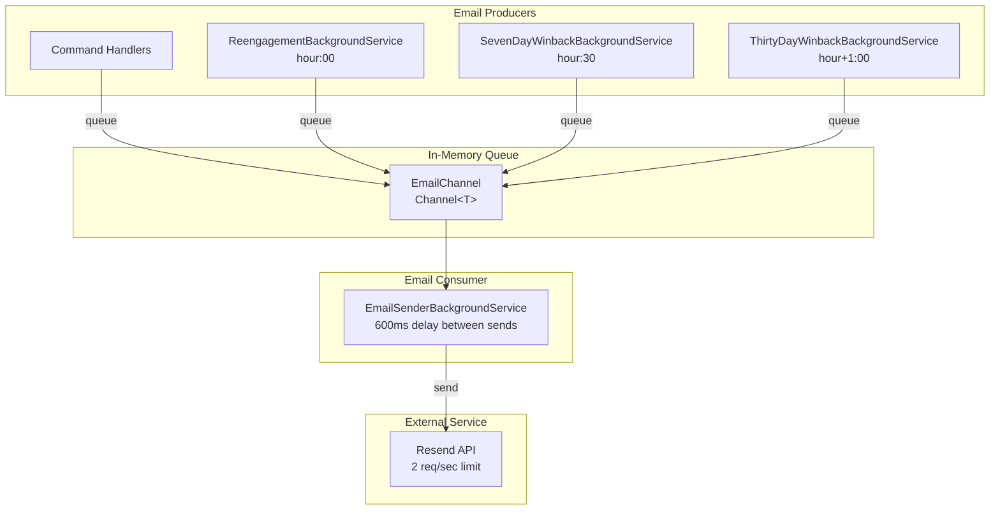
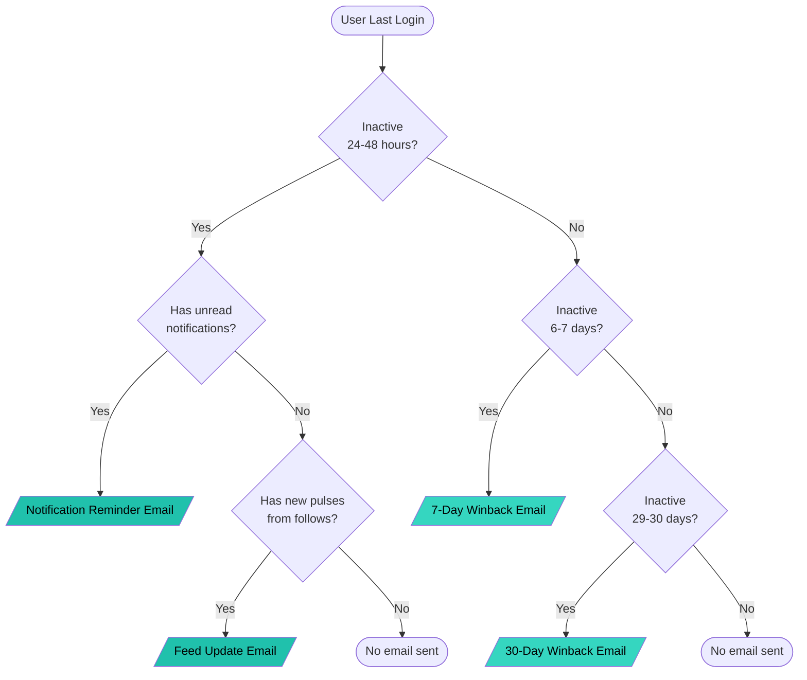
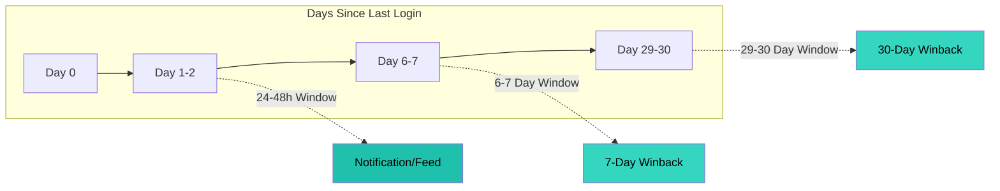

# Email Infrastructure

> **Status**: Implemented
> **Provider**: Resend (3,000 emails/month free tier, 2 req/sec rate limit)
> **Processing**: Channel<T> + BackgroundService (non-blocking, rate-limited)

---

## Overview

The email system sends five types of emails:

| Email Type | Trigger | Window | Content Filter |
|------------|---------|--------|----------------|
| Welcome | Registration | Immediate | None |
| Notification Reminder | Daily job | 24-48h inactive | Has unread notifications |
| Feed Update | Daily job | 24-48h inactive | Has new pulses from follows |
| 7-Day Winback | Daily job | 6-7 days inactive | None (all users) |
| 30-Day Winback | Daily job | 29-30 days inactive | None (all users) |

Re-engagement emails are processed daily starting at a configurable hour (default: **8 AM UTC**), with services staggered 30 minutes apart to avoid rate limiting.

---

## Architecture



> See [diagrams/architecture.md](diagrams/architecture.md) for more details.

### Design Principles

1. **Non-blocking**: Emails are queued via Channel<T>, handlers return immediately
2. **Single sender**: All emails flow through one background service
3. **Rate-limited**: 600ms delay between sends to respect Resend's 2 req/sec limit
4. **Fail-safe**: Email failures are logged but never crash the app
5. **DateTimeOffset**: All timestamps use `DateTimeOffset.UtcNow`

---

## File Structure

```
Application/
└── Common/
    └── Interfaces/
        ├── IEmailQueue.cs              # Queue interface (5 methods)
        └── IReengagementRepository.cs  # Repository + ReengagementCandidate + WinbackCandidate

Infrastructure/
├── Configuration/
│   └── EmailSettings.cs                # Resend configuration
├── Email/
│   ├── QueuedEmail.cs                  # Queue message record
│   ├── EmailChannel.cs                 # Channel<T> wrapper (singleton)
│   ├── EmailTemplates.cs               # HTML templates with branding
│   ├── EmailQueue.cs                   # IEmailQueue implementation
│   ├── ResendEmailSender.cs            # Resend API wrapper
│   ├── EmailSenderBackgroundService.cs # Processes queue continuously
│   ├── ReengagementBackgroundService.cs# Daily job (hour:00) - 24-48h emails
│   ├── SevenDayWinbackBackgroundService.cs  # Daily job (hour:30) - 7-day winback
│   └── ThirtyDayWinbackBackgroundService.cs # Daily job (hour+1:00) - 30-day winback
└── Persistence/
    └── Repositories/
        └── ReengagementRepository.cs   # Inactive user queries
```

---

## Configuration

### appsettings.json (non-sensitive defaults)

| Setting | Default | Description |
|---------|---------|-------------|
| `Email:FromName` | `"Codewrinkles"` | Display name in From field |
| `Email:BaseUrl` | `"https://codewrinkles.com"` | Base URL for email links |
| `Email:ReengagementHourUtc` | `8`* | Hour (0-23) when daily job runs |
| `Email:ReengagementBatchSize` | `100` | Max emails per re-engagement run |

*Currently set to 8 for testing. Change to 4 for production via Azure config.

### Environment Variables (Azure App Service)

| Variable | Description |
|----------|-------------|
| `Email__ApiKey` | Resend API key |
| `Email__FromAddress` | Sender email (e.g., `dan@codewrinkles.com`) |
| `Email__WinbackCampaignEnabled` | `true` = all dormant users, `false` = normal 24-48h window |
| `Email__ReengagementHourUtc` | Override the scheduled hour (e.g., `4` for 4 AM UTC) |

### Local Development (User Secrets)

```bash
cd apps/backend/src/Codewrinkles.API
dotnet user-secrets set "Email:ApiKey" "<your-resend-api-key>"
dotnet user-secrets set "Email:FromAddress" "<your-verified-sender-email>"
```

---

## Email Decision Logic



> See [diagrams/email-decision-tree.md](diagrams/email-decision-tree.md) for more details.

---

## Time Windows

Each window is a 24-hour slice that ensures users receive exactly one email per tier:



**Why Windows Work:**
- Before 24h: Too soon (might just be sleeping/working)
- 24h-48h: Eligible window - send re-engagement email
- After 48h: Window passed - email was already sent yesterday
- If user logs in: LastLoginAt resets, exits all windows

> See [diagrams/time-windows.md](diagrams/time-windows.md) for more details.

---

## Service Schedule

Services run staggered to avoid rate limiting:

| Service | Schedule | Window | Email Type |
|---------|----------|--------|------------|
| `ReengagementBackgroundService` | `hour:00` | 24-48 hours inactive | Notification/Feed |
| `SevenDayWinbackBackgroundService` | `hour:30` | 6-7 days inactive | Winback |
| `ThirtyDayWinbackBackgroundService` | `hour+1:00` | 29-30 days inactive | Winback |

Example with default hour (`ReengagementHourUtc = 4`):
- **4:00 AM UTC** - 24-48h re-engagement emails
- **4:30 AM UTC** - 7-day winback emails
- **5:00 AM UTC** - 30-day winback emails

> See [diagrams/service-schedule.md](diagrams/service-schedule.md) for more details.

---

## Win-Back Campaign Mode

When first deploying the email system, there may be dormant users who became inactive before the system existed. The normal 24-48 hour window won't catch them.

**Configuration flag:** `Email:WinbackCampaignEnabled`

| Value | Behavior |
|-------|----------|
| `true` (default) | Send emails to ALL users inactive >24 hours (no upper limit) |
| `false` | Normal 24-48 hour window |

**Deployment process:**
1. Deploy with `WinbackCampaignEnabled = true` (the default)
2. Service runs at scheduled hour, sends win-back emails to all dormant users
3. Verify emails were sent (check logs, Resend dashboard)
4. Set `Email__WinbackCampaignEnabled = false` in Azure App Configuration
5. Normal 24-48 hour window logic resumes

---

## Email Templates

All templates use Codewrinkles branding:
- Brand teal: `#20C1AC`
- Brand soft: `#35D6C0`
- Light theme for email client compatibility
- Table-based HTML for consistent rendering
- Mobile-responsive design

| Email | Subject | CTA | Destination |
|-------|---------|-----|-------------|
| Welcome | "Welcome to Pulse!" | "Start Exploring" | `/social` |
| Notification Reminder | "You have X unread notifications on Pulse" | "See What You Missed" | `/social/notifications` |
| Feed Update | "Your feed has X new pulses" | "See Your Feed" | `/social` |
| 7-Day Winback | "We miss you on Pulse!" | "Come Back to Pulse" | `/pulse` |
| 30-Day Winback | "It's been a while - come back to Pulse!" | "Rejoin the Conversation" | `/pulse` |

> See [diagrams/email-types.md](diagrams/email-types.md) for more details.

---

## Service Lifetimes

| Service | Lifetime | Reason |
|---------|----------|--------|
| `EmailChannel` | Singleton | Shared in-memory queue |
| `EmailQueue` | Singleton | Stateless, uses singleton channel |
| `ResendEmailSender` | Scoped | Uses IResend for HTTP calls |
| `IResend` | Transient | Managed by HttpClientFactory |
| `ReengagementRepository` | Scoped | Uses DbContext |
| `EmailSenderBackgroundService` | Singleton | Hosted service |
| `ReengagementBackgroundService` | Singleton | Hosted service |
| `SevenDayWinbackBackgroundService` | Singleton | Hosted service |
| `ThirtyDayWinbackBackgroundService` | Singleton | Hosted service |

---

## Rate Limiting

Resend has a rate limit of **2 requests per second** on the free tier. The `EmailSenderBackgroundService` adds a 600ms delay between emails to stay safely under this limit.

For batch operations (like win-back campaigns with many emails), this means:
- 10 emails = 6 seconds
- 100 emails = 60 seconds

---

## Troubleshooting

### Diagnosing email issues via Application Insights

**Find all email-related logs:**
```kql
traces
| where timestamp >= ago(4h)
| where message has "re-engagement" or message has "email" or message has "Email"
| order by timestamp desc
| project timestamp, message, severityLevel
```

**Find exceptions (including rate limit errors):**
```kql
exceptions
| where timestamp >= ago(4h)
| order by timestamp desc
| project timestamp, type, outerMessage, innermostMessage
```

**Find re-engagement and winback job execution details:**
```kql
traces
| where timestamp >= ago(4h)
| where message has "candidates" or message has "Queued" or message has "Win-back" or message has "winback"
| order by timestamp asc
| project timestamp, message
```

### Common Issues

| Symptom | Cause | Solution |
|---------|-------|----------|
| `ResendException: Too many requests` | Sending faster than 2 req/sec | Fixed in code with 600ms delay |
| No "Found X candidates" log | Logging level too high | Set `Codewrinkles.Infrastructure.Email: Information` |
| 0 candidates found | No users in time window OR no notifications/feed content | Check with diagnostic SQL query |
| Emails queued but not sent | Check EmailSenderBackgroundService logs | Look for exceptions in App Insights |

### Diagnostic SQL Query

Find all dormant users and see who would receive emails:
```sql
SELECT
    i.Email, p.Name, i.LastLoginAt,
    (SELECT COUNT(*) FROM [notification].Notifications n
     WHERE n.RecipientId = p.Id AND n.IsRead = 0) AS UnreadNotifications,
    (SELECT COUNT(*) FROM [social].Follows f
     INNER JOIN [pulse].Pulses pu ON f.FollowingId = pu.AuthorId
     WHERE f.FollowerId = p.Id AND pu.CreatedAt > i.LastLoginAt) AS NewPulsesFromFollows
FROM [identity].Identities i
INNER JOIN [identity].Profiles p ON i.Id = p.IdentityId
WHERE i.IsActive = 1 AND i.LastLoginAt IS NOT NULL
  AND i.LastLoginAt < DATEADD(HOUR, -24, SYSDATETIMEOFFSET())
ORDER BY i.LastLoginAt DESC
```

---

## Trade-offs

| Decision | Trade-off | Mitigation |
|----------|-----------|------------|
| In-memory queue | Emails lost on app restart | Acceptable at current scale; add persistence if needed |
| Time windows only | No emails outside defined windows (e.g., day 8-28) | Windows cover key re-engagement moments; gaps are intentional |
| Hardcoded templates | Deployment required to change content | Templates rarely change |
| No unsubscribe link | Legal requirement before scaling | Add before reaching 100+ re-engagement emails |
| No email logging | Harder to debug delivery issues | Add EmailLog entity if debugging needed |

---

## Future Extensions

### Unsubscribe Support
- Add `EmailPreferences` to Profile or separate entity
- Add signed unsubscribe token to email links
- Create `/api/email/unsubscribe` endpoint
- Filter unsubscribed users in re-engagement query

### Email Logging
- Create `EmailLog` entity (Id, ToEmail, Subject, Template, SentAt, Status, Error)
- Log all send attempts for debugging
- Add retry logic for transient failures

### Notification Breakdown
- Enhance notification reminder with breakdown:
  - "3 replies to your pulses"
  - "2 new followers"
  - "1 mention"
- Requires grouping by notification type in query

---

## Diagrams

All diagrams are available in the [diagrams/](diagrams/) folder:

- [architecture.md](diagrams/architecture.md) - Email system architecture and flow
- [email-decision-tree.md](diagrams/email-decision-tree.md) - How the system decides which email to send
- [email-types.md](diagrams/email-types.md) - Overview of all email types
- [service-schedule.md](diagrams/service-schedule.md) - Background service staggered schedule
- [time-windows.md](diagrams/time-windows.md) - Inactivity time windows for each email type

---

*Last updated: 2025-12-14*
