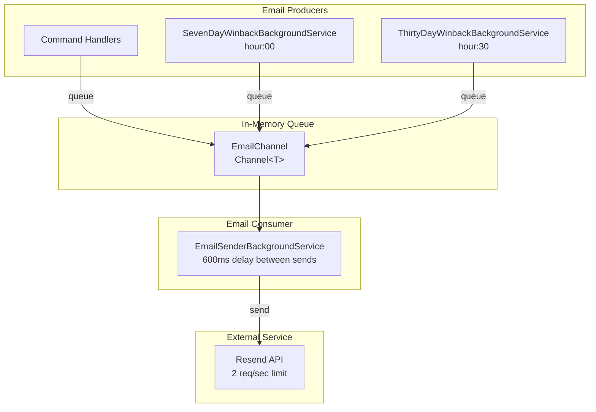
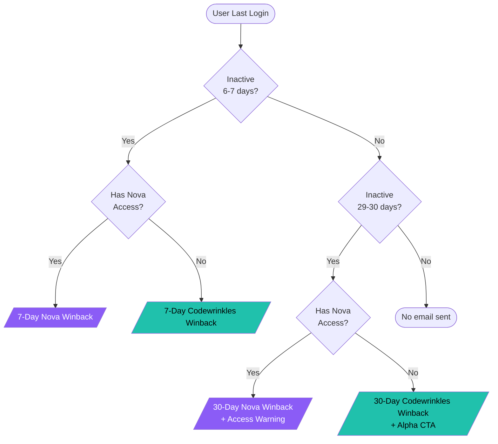
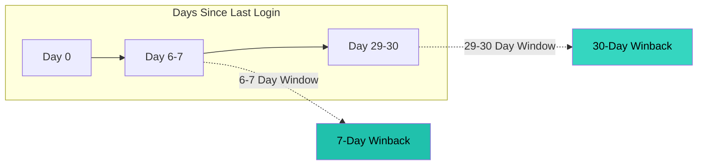

# Email Infrastructure

> **Status**: Implemented
> **Provider**: Resend (3,000 emails/month free tier, 2 req/sec rate limit)
> **Processing**: Channel<T> + BackgroundService (non-blocking, rate-limited)

---

## Overview

The email system sends differentiated emails based on user type (Nova vs non-Nova):

| Email Type | Trigger | Window | Nova User | Non-Nova User |
|------------|---------|--------|-----------|---------------|
| Welcome | Registration | Immediate | Combined welcome | Combined welcome |
| 7-Day Winback | Daily job | 6-7 days inactive | "We miss you on Nova!" | "We miss you on Codewrinkles!" |
| 30-Day Winback | Daily job | 29-30 days inactive | Access warning | What you're missing + Alpha CTA |

Winback emails are processed daily starting at a configurable hour (default: **4 AM UTC**), with services staggered 30 minutes apart to avoid rate limiting.

---

## Architecture


```mermaid
flowchart TB
    subgraph Producers["Email Producers"]
        CH[Command Handlers]
        SW[SevenDayWinbackBackgroundService<br/>hour:00]
        TW[ThirtyDayWinbackBackgroundService<br/>hour:30]
    end

    subgraph Queue["In-Memory Queue"]
        EC[EmailChannel<br/>Channel&lt;T&gt;]
    end

    subgraph Consumer["Email Consumer"]
        ES[EmailSenderBackgroundService<br/>600ms delay between sends]
    end

    subgraph External["External Service"]
        RS[Resend API<br/>2 req/sec limit]
    end

    CH -->|queue| EC
    SW -->|queue| EC
    TW -->|queue| EC
    EC --> ES
    ES -->|send| RS
```

> See [diagrams/architecture.md](diagrams/architecture.md) for more details.

### Design Principles

1. **Non-blocking**: Emails are queued via Channel<T>, handlers return immediately
2. **Single sender**: All emails flow through one background service
3. **Rate-limited**: 600ms delay between sends to respect Resend's 2 req/sec limit
4. **Fail-safe**: Email failures are logged but never crash the app
5. **DateTimeOffset**: All timestamps use `DateTimeOffset.UtcNow`
6. **Nova-aware**: Winback emails are differentiated based on user's Nova access status

---

## File Structure

```
Application/
└── Common/
    └── Interfaces/
        ├── IEmailQueue.cs              # Queue interface (8 methods)
        └── IReengagementRepository.cs  # Repository + WinbackCandidate (with HasNovaAccess)

Infrastructure/
├── Configuration/
│   └── EmailSettings.cs                # Resend configuration
├── Email/
│   ├── QueuedEmail.cs                  # Queue message record
│   ├── EmailChannel.cs                 # Channel<T> wrapper (singleton)
│   ├── EmailTemplates.cs               # HTML templates with branding
│   ├── EmailQueue.cs                   # IEmailQueue implementation
│   ├── ResendEmailSender.cs            # Resend API wrapper
│   ├── EmailSenderBackgroundService.cs # Processes queue continuously
│   ├── SevenDayWinbackBackgroundService.cs  # Daily job (hour:00) - 7-day winback
│   └── ThirtyDayWinbackBackgroundService.cs # Daily job (hour:30) - 30-day winback
└── Persistence/
    └── Repositories/
        └── ReengagementRepository.cs   # Inactive user queries (includes Nova access)
```

---

## Configuration

### appsettings.json (non-sensitive defaults)

| Setting | Default | Description |
|---------|---------|-------------|
| `Email:FromName` | `"Codewrinkles"` | Display name in From field |
| `Email:BaseUrl` | `"https://codewrinkles.com"` | Base URL for email links |
| `Email:ReengagementHourUtc` | `4` | Hour (0-23) when daily job runs |
| `Email:ReengagementBatchSize` | `100` | Max emails per winback run |

### Environment Variables (Azure App Service)

| Variable | Description |
|----------|-------------|
| `Email__ApiKey` | Resend API key |
| `Email__FromAddress` | Sender email (e.g., `dan@codewrinkles.com`) |
| `Email__ReengagementHourUtc` | Override the scheduled hour (e.g., `4` for 4 AM UTC) |

### Local Development (User Secrets)

```bash
cd apps/backend/src/Codewrinkles.API
dotnet user-secrets set "Email:ApiKey" "<your-resend-api-key>"
dotnet user-secrets set "Email:FromAddress" "<your-verified-sender-email>"
```

---

## Email Decision Logic


```mermaid
flowchart TD
    Start([User Last Login]) --> Check7{Inactive<br/>6-7 days?}

    Check7 -->|Yes| HasNova7{Has Nova<br/>Access?}
    Check7 -->|No| Check30{Inactive<br/>29-30 days?}

    HasNova7 -->|Yes| Nova7[/7-Day Nova Winback/]
    HasNova7 -->|No| CW7[/7-Day Codewrinkles Winback/]

    Check30 -->|Yes| HasNova30{Has Nova<br/>Access?}
    Check30 -->|No| NoEmail([No email sent])

    HasNova30 -->|Yes| Nova30[/30-Day Nova Winback<br/>+ Access Warning/]
    HasNova30 -->|No| CW30[/30-Day Codewrinkles Winback<br/>+ Alpha CTA/]

    style Nova7 fill:#8B5CF6,color:#fff
    style Nova30 fill:#8B5CF6,color:#fff
    style CW7 fill:#20C1AC,color:#000
    style CW30 fill:#20C1AC,color:#000
```

> See [diagrams/email-decision-tree.md](diagrams/email-decision-tree.md) for more details.

---

## Time Windows

Each window is a 24-hour slice that ensures users receive exactly one email per tier:


```mermaid
flowchart LR
    subgraph Timeline["Days Since Last Login"]
        D0[Day 0]
        D6[Day 6-7]
        D29[Day 29-30]
    end

    D0 --> D6
    D6 --> D29

    D6 -.->|"6-7 Day Window"| E1[7-Day Winback]
    D29 -.->|"29-30 Day Window"| E2[30-Day Winback]

    style E1 fill:#20C1AC,color:#000
    style E2 fill:#35D6C0,color:#000
```

**Why Windows Work:**
- Before 6 days: Users may just be busy, too early to send winback
- 6-7 days: First winback email - gentle reminder
- 29-30 days: Final winback email - more urgent (Nova users get access warning)
- If user logs in: LastLoginAt resets, exits all windows

> See [diagrams/time-windows.md](diagrams/time-windows.md) for more details.

---

## Service Schedule

Services run staggered to avoid rate limiting:

| Service | Schedule | Window | Email Types |
|---------|----------|--------|-------------|
| `SevenDayWinbackBackgroundService` | `hour:00` | 6-7 days inactive | Nova or Codewrinkles winback |
| `ThirtyDayWinbackBackgroundService` | `hour:30` | 29-30 days inactive | Nova or Codewrinkles winback |

Example with default hour (`ReengagementHourUtc = 4`):
- **4:00 AM UTC** - 7-day winback emails
- **4:30 AM UTC** - 30-day winback emails

> See [diagrams/service-schedule.md](diagrams/service-schedule.md) for more details.

---

## Email Templates

All templates use Codewrinkles branding:
- Brand teal: `#20C1AC`
- Brand soft: `#35D6C0`
- Nova violet: `#8B5CF6`
- Light theme for email client compatibility
- Table-based HTML for consistent rendering
- Mobile-responsive design

### Winback Emails (Nova Users)

| Email | Subject | Content | CTA |
|-------|---------|---------|-----|
| 7-Day Nova | "We miss you on Nova!" | Nova remembers your journey | "Continue with Nova" → `/nova` |
| 30-Day Nova | "Important: Your Nova Alpha access" | Access warning (Alpha needs engaged users) | "Return to Nova" → `/nova` |

### Winback Emails (Non-Nova Users)

| Email | Subject | Content | CTA |
|-------|---------|---------|-----|
| 7-Day Codewrinkles | "We miss you on Codewrinkles!" | What you're missing (Pulse + Nova) | "Come Back to Codewrinkles" → `/` |
| 30-Day Codewrinkles | "Come back and discover Codewrinkles" | What you're missing + how to get Nova (apply or 15 pulses) | "Rejoin Codewrinkles" → `/` |

### Other Emails

| Email | Subject | CTA | Destination |
|-------|---------|-----|-------------|
| Welcome | "Welcome to Codewrinkles!" | "Start Exploring" | `/pulse` |
| Alpha Acceptance | "You're In! Welcome to Nova Alpha" | "Redeem Your Code" | `/nova/redeem` |
| Alpha Waitlist | "You're on the Nova Waitlist" | "Explore Pulse" | `/pulse` |
| Pulse Alpha Earned | "You Earned Nova Alpha Access!" | "Start Using Nova" | `/nova` |

> See [diagrams/email-types.md](diagrams/email-types.md) for more details.

---

## Service Lifetimes

| Service | Lifetime | Reason |
|---------|----------|--------|
| `EmailChannel` | Singleton | Shared in-memory queue |
| `EmailQueue` | Singleton | Stateless, uses singleton channel |
| `ResendEmailSender` | Scoped | Uses IResend for HTTP calls |
| `IResend` | Transient | Managed by HttpClientFactory |
| `ReengagementRepository` | Scoped | Uses DbContext |
| `EmailSenderBackgroundService` | Singleton | Hosted service |
| `SevenDayWinbackBackgroundService` | Singleton | Hosted service |
| `ThirtyDayWinbackBackgroundService` | Singleton | Hosted service |

---

## Rate Limiting

Resend has a rate limit of **2 requests per second** on the free tier. The `EmailSenderBackgroundService` adds a 600ms delay between emails to stay safely under this limit.

For batch operations (like winback campaigns with many emails), this means:
- 10 emails = 6 seconds
- 100 emails = 60 seconds

---

## Troubleshooting

### Diagnosing email issues via Application Insights

**Find all email-related logs:**
```kql
traces
| where timestamp >= ago(4h)
| where message has "winback" or message has "email" or message has "Email"
| order by timestamp desc
| project timestamp, message, severityLevel
```

**Find exceptions (including rate limit errors):**
```kql
exceptions
| where timestamp >= ago(4h)
| order by timestamp desc
| project timestamp, type, outerMessage, innermostMessage
```

**Find winback job execution details:**
```kql
traces
| where timestamp >= ago(4h)
| where message has "candidates" or message has "Queued" or message has "winback"
| order by timestamp asc
| project timestamp, message
```

### Common Issues

| Symptom | Cause | Solution |
|---------|-------|----------|
| `ResendException: Too many requests` | Sending faster than 2 req/sec | Fixed in code with 600ms delay |
| No "Found X candidates" log | Logging level too high | Set `Codewrinkles.Infrastructure.Email: Information` |
| 0 candidates found | No users in time window | Check with diagnostic SQL query |
| Emails queued but not sent | Check EmailSenderBackgroundService logs | Look for exceptions in App Insights |

### Diagnostic SQL Query

Find all dormant users and see who would receive emails:
```sql
SELECT
    i.Email, p.Name, i.LastLoginAt,
    p.NovaAccess,
    CASE WHEN p.NovaAccess > 0 THEN 'Nova User' ELSE 'Non-Nova User' END AS UserType
FROM [identity].Identities i
INNER JOIN [identity].Profiles p ON i.Id = p.IdentityId
WHERE i.IsActive = 1 AND i.LastLoginAt IS NOT NULL
  AND i.LastLoginAt < DATEADD(DAY, -6, SYSDATETIMEOFFSET())
ORDER BY i.LastLoginAt DESC
```

---

## Trade-offs

| Decision | Trade-off | Mitigation |
|----------|-----------|------------|
| In-memory queue | Emails lost on app restart | Acceptable at current scale; add persistence if needed |
| Time windows only | No emails between day 8-28 | Gaps are intentional to avoid email fatigue |
| Hardcoded templates | Deployment required to change content | Templates rarely change |
| No unsubscribe link | Legal requirement before scaling | Add before reaching 100+ winback emails |
| No email logging | Harder to debug delivery issues | Add EmailLog entity if debugging needed |

---

## Future Extensions

### Unsubscribe Support
- Add `EmailPreferences` to Profile or separate entity
- Add signed unsubscribe token to email links
- Create `/api/email/unsubscribe` endpoint
- Filter unsubscribed users in winback query

### Email Logging
- Create `EmailLog` entity (Id, ToEmail, Subject, Template, SentAt, Status, Error)
- Log all send attempts for debugging
- Add retry logic for transient failures

### Nova Access Revocation
- Implement actual access revocation for users inactive >30 days
- Add `RevokeNovaAccess()` method to Profile entity
- Create background service or extend 30-day service

---

## Diagrams

All diagrams are available in the [diagrams/](diagrams/) folder:

- [architecture.md](diagrams/architecture.md) - Email system architecture and flow
- [email-decision-tree.md](diagrams/email-decision-tree.md) - How the system decides which email to send
- [email-types.md](diagrams/email-types.md) - Overview of all email types
- [service-schedule.md](diagrams/service-schedule.md) - Background service staggered schedule
- [time-windows.md](diagrams/time-windows.md) - Inactivity time windows for each email type

---

*Last updated: 2025-12-28*
