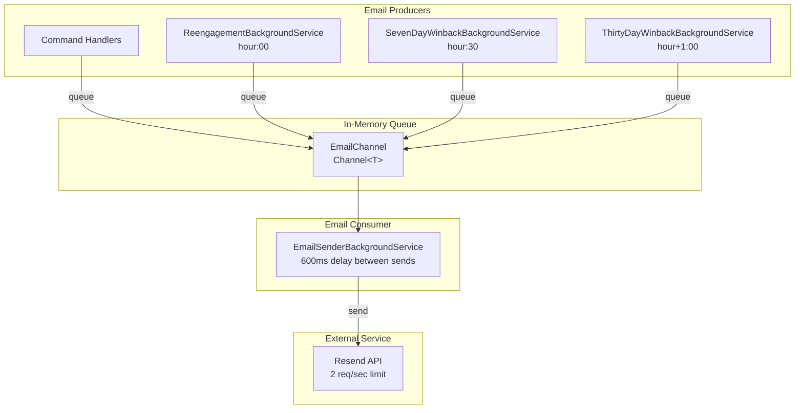

# Email System Architecture

## Description

The email system follows a producer-consumer pattern:

1. **Producers** queue emails to the channel:
   - Command handlers (welcome emails after registration)
   - Background services (re-engagement and winback emails)

2. **Queue** (EmailChannel) is a thread-safe `Channel<T>` that decouples producers from the sending process

3. **Consumer** (EmailSenderBackgroundService) reads from the queue and sends emails with rate limiting

4. **External Service** (Resend) receives the actual email send requests
