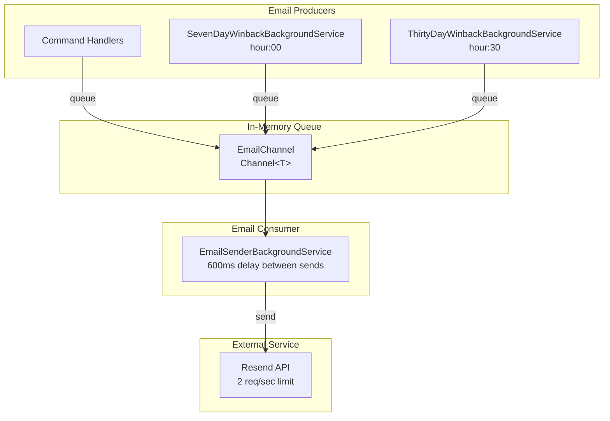
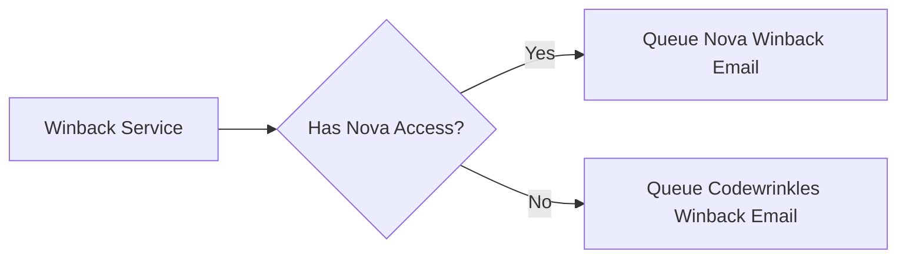

# Email System Architecture

```mermaid
flowchart TB
    subgraph Producers["Email Producers"]
        CH[Command Handlers]
        SW[SevenDayWinbackBackgroundService<br/>hour:00]
        TW[ThirtyDayWinbackBackgroundService<br/>hour:30]
    end

    subgraph Queue["In-Memory Queue"]
        EC[EmailChannel<br/>Channel&lt;T&gt;]
    end

    subgraph Consumer["Email Consumer"]
        ES[EmailSenderBackgroundService<br/>600ms delay between sends]
    end

    subgraph External["External Service"]
        RS[Resend API<br/>2 req/sec limit]
    end

    CH -->|queue| EC
    SW -->|queue| EC
    TW -->|queue| EC
    EC --> ES
    ES -->|send| RS
```

## Description

The email system follows a producer-consumer pattern:

1. **Producers** queue emails to the channel:
   - Command handlers (welcome emails after registration, alpha acceptance, etc.)
   - Background services (7-day and 30-day winback emails)

2. **Queue** (EmailChannel) is a thread-safe `Channel<T>` that decouples producers from the sending process

3. **Consumer** (EmailSenderBackgroundService) reads from the queue and sends emails with rate limiting

4. **External Service** (Resend) receives the actual email send requests

## Nova-Aware Winback

Winback services differentiate emails based on `HasNovaAccess`:

```mermaid
flowchart LR
    WS[Winback Service] --> Check{Has Nova Access?}
    Check -->|Yes| Nova[Queue Nova Winback Email]
    Check -->|No| CW[Queue Codewrinkles Winback Email]
```

---

*Last updated: 2025-12-28*
