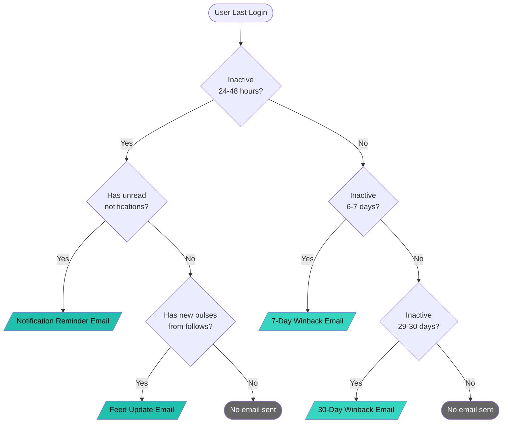

# Email Type Decision Tree

## Decision Logic

### 24-48 Hour Window (Content-Based)
- **Notification Reminder**: User has unread notifications
- **Feed Update**: User has no notifications but follows posted new pulses
- **No Email**: Neither condition met (nothing valuable to offer)

### 7-Day and 30-Day Windows (Pure Winback)
- Sent to ALL users in the window
- No content filter required
- Pure "we miss you" messaging
