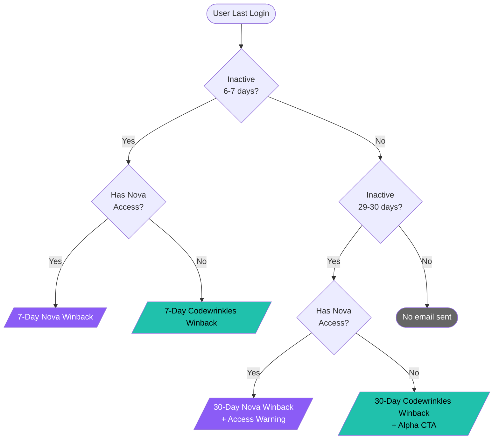

# Email Type Decision Tree


```mermaid
flowchart TD
    Start([User Last Login]) --> Check7{Inactive<br/>6-7 days?}

    Check7 -->|Yes| HasNova7{Has Nova<br/>Access?}
    Check7 -->|No| Check30{Inactive<br/>29-30 days?}

    HasNova7 -->|Yes| Nova7[/7-Day Nova Winback/]
    HasNova7 -->|No| CW7[/7-Day Codewrinkles Winback/]

    Check30 -->|Yes| HasNova30{Has Nova<br/>Access?}
    Check30 -->|No| NoEmail([No email sent])

    HasNova30 -->|Yes| Nova30[/30-Day Nova Winback<br/>+ Access Warning/]
    HasNova30 -->|No| CW30[/30-Day Codewrinkles Winback<br/>+ Alpha CTA/]

    style Nova7 fill:#8B5CF6,color:#fff
    style Nova30 fill:#8B5CF6,color:#fff
    style CW7 fill:#20C1AC,color:#000
    style CW30 fill:#20C1AC,color:#000
    style NoEmail fill:#666,color:#fff
```

## Decision Logic

### 7-Day Window
- **Nova Users**: "We miss you on Nova!" - emphasizes Nova remembers their journey
- **Non-Nova Users**: "We miss you on Codewrinkles!" - highlights Pulse + Nova features

### 30-Day Window
- **Nova Users**: Access warning - politely explains Alpha needs engaged users
- **Non-Nova Users**: Alpha CTA - how to get Nova access (apply or 15 pulses)

### Nova Detection

The `WinbackCandidate` record includes `HasNovaAccess`:

```csharp
public sealed record WinbackCandidate(
    Guid ProfileId,
    string Email,
    string Name,
    bool HasNovaAccess);
```

Query checks `Profile.NovaAccess != NovaAccessLevel.None`.

---

*Last updated: 2025-12-28*
