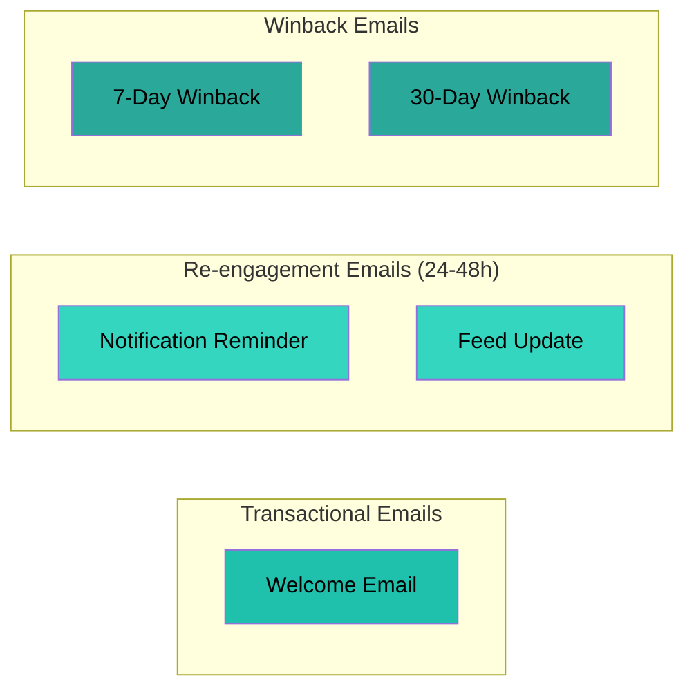
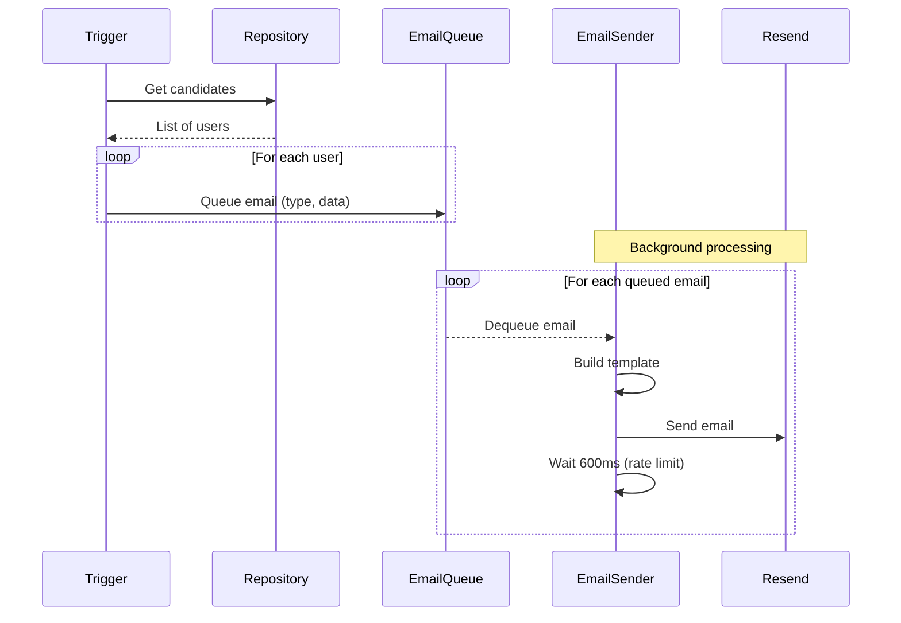

# Email Types

## Email Details

### Welcome Email
- **Trigger**: Immediately after registration
- **Subject**: "Welcome to Pulse!"
- **CTA**: "Start Exploring" → `/social`
- **Filter**: None (all new users)

### Notification Reminder
- **Trigger**: Daily job, 24-48h inactive
- **Subject**: "You have X unread notifications on Pulse"
- **CTA**: "See What You Missed" → `/social/notifications`
- **Filter**: Must have unread notifications

### Feed Update
- **Trigger**: Daily job, 24-48h inactive
- **Subject**: "Your feed has X new pulses"
- **CTA**: "See Your Feed" → `/social`
- **Filter**: No notifications, but has new pulses from follows

### 7-Day Winback
- **Trigger**: Daily job, 6-7 days inactive
- **Subject**: "We miss you on Pulse!"
- **CTA**: "Come Back to Pulse" → `/pulse`
- **Filter**: None (all users in window)

### 30-Day Winback
- **Trigger**: Daily job, 29-30 days inactive
- **Subject**: "It's been a while - come back to Pulse!"
- **CTA**: "Rejoin the Conversation" → `/pulse`
- **Filter**: None (all users in window)

## Email Flow per Type

