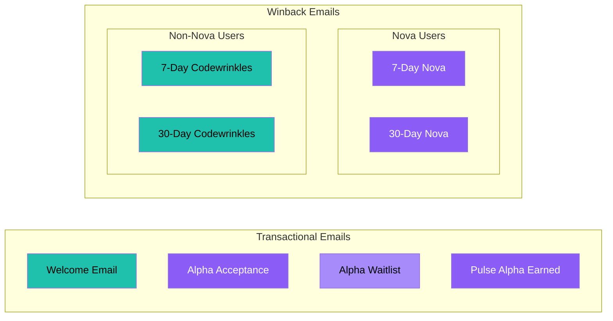
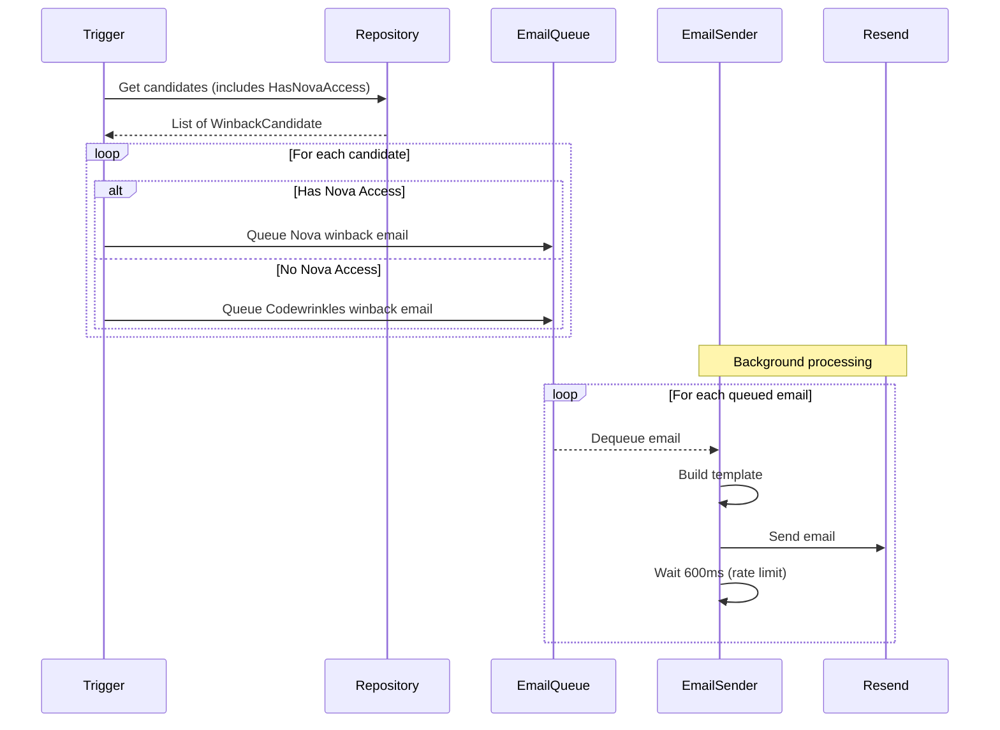

# Email Types

```mermaid
flowchart LR
    subgraph Transactional["Transactional Emails"]
        W[Welcome Email]
        AA[Alpha Acceptance]
        AW[Alpha Waitlist]
        PAE[Pulse Alpha Earned]
    end

    subgraph Winback["Winback Emails"]
        subgraph Nova["Nova Users"]
            N7[7-Day Nova]
            N30[30-Day Nova]
        end
        subgraph CW["Non-Nova Users"]
            C7[7-Day Codewrinkles]
            C30[30-Day Codewrinkles]
        end
    end

    style W fill:#20C1AC,color:#000
    style AA fill:#8B5CF6,color:#fff
    style AW fill:#A78BFA,color:#000
    style PAE fill:#8B5CF6,color:#fff
    style N7 fill:#8B5CF6,color:#fff
    style N30 fill:#8B5CF6,color:#fff
    style C7 fill:#20C1AC,color:#000
    style C30 fill:#20C1AC,color:#000
```

## Email Details

### Transactional Emails

| Email | Subject | CTA | Destination |
|-------|---------|-----|-------------|
| Welcome | "Welcome to Codewrinkles!" | "Start Exploring" | `/pulse` |
| Alpha Acceptance | "You're In! Welcome to Nova Alpha" | "Redeem Your Code" | `/nova/redeem` |
| Alpha Waitlist | "You're on the Nova Waitlist" | "Explore Pulse" | `/pulse` |
| Pulse Alpha Earned | "You Earned Nova Alpha Access!" | "Start Using Nova" | `/nova` |

### Winback Emails (Nova Users)

| Email | Trigger | Subject | Key Content | CTA |
|-------|---------|---------|-------------|-----|
| 7-Day Nova | 6-7 days inactive | "We miss you on Nova!" | Nova remembers your journey | "Continue with Nova" → `/nova` |
| 30-Day Nova | 29-30 days inactive | "Important: Your Nova Alpha access" | Access warning for Alpha | "Return to Nova" → `/nova` |

### Winback Emails (Non-Nova Users)

| Email | Trigger | Subject | Key Content | CTA |
|-------|---------|---------|-------------|-----|
| 7-Day Codewrinkles | 6-7 days inactive | "We miss you on Codewrinkles!" | What you're missing (Pulse + Nova) | "Come Back to Codewrinkles" → `/` |
| 30-Day Codewrinkles | 29-30 days inactive | "Come back and discover Codewrinkles" | What you're missing + Alpha CTA | "Rejoin Codewrinkles" → `/` |

## Email Flow

```mermaid
sequenceDiagram
    participant T as Trigger
    participant R as Repository
    participant Q as EmailQueue
    participant S as EmailSender
    participant API as Resend

    T->>R: Get candidates (includes HasNovaAccess)
    R-->>T: List of WinbackCandidate
    loop For each candidate
        alt Has Nova Access
            T->>Q: Queue Nova winback email
        else No Nova Access
            T->>Q: Queue Codewrinkles winback email
        end
    end

    Note over S,API: Background processing
    loop For each queued email
        Q-->>S: Dequeue email
        S->>S: Build template
        S->>API: Send email
        S->>S: Wait 600ms (rate limit)
    end
```

---

*Last updated: 2025-12-28*
