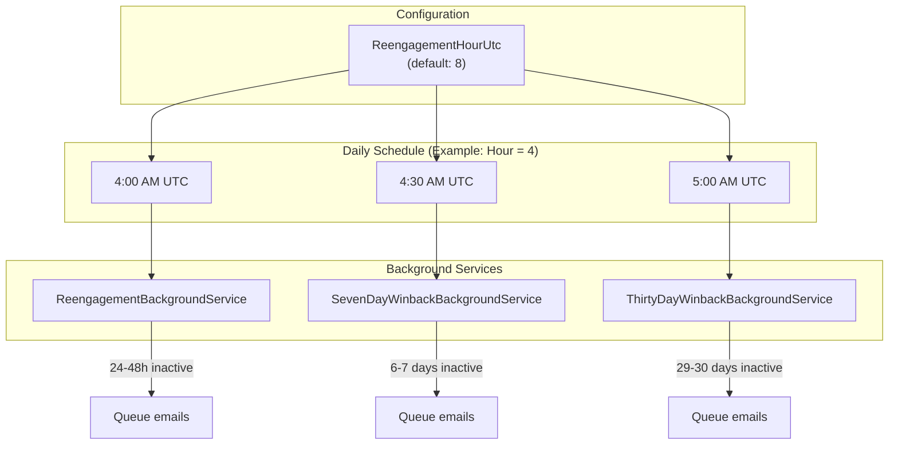
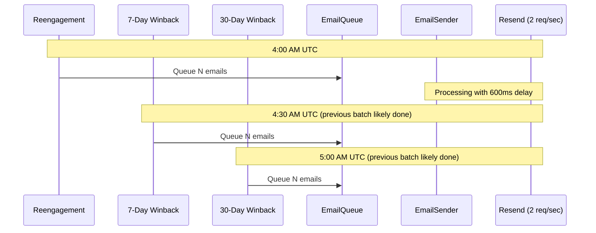
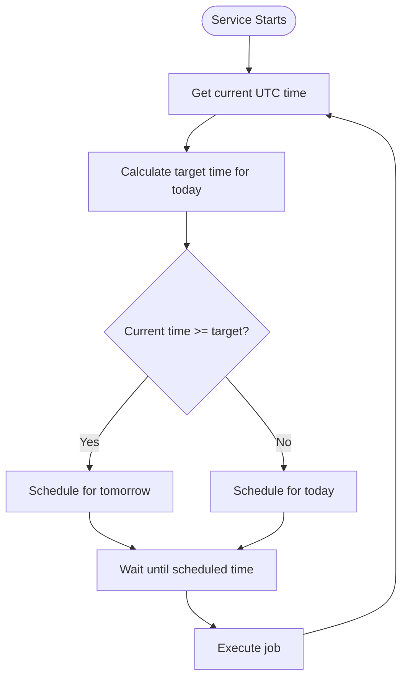

# Background Service Schedule

## Schedule Pattern

| Service | Time Offset | Example (Hour=4) |
|---------|-------------|------------------|
| ReengagementBackgroundService | `hour:00` | 4:00 AM UTC |
| SevenDayWinbackBackgroundService | `hour:30` | 4:30 AM UTC |
| ThirtyDayWinbackBackgroundService | `hour+1:00` | 5:00 AM UTC |

## Why Staggered?

The 30-minute gaps ensure:
- Previous batch has time to process
- Resend rate limit (2 req/sec) is respected
- No bursts that could trigger throttling

## Calculation Logic

Each service calculates next run time on startup and after each run:

