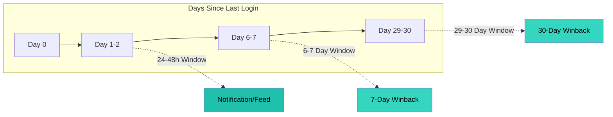

# Email Time Windows

```mermaid
gantt
    title User Inactivity Timeline and Email Windows
    dateFormat X
    axisFormat Day %s

    section 24-48h
    Notification/Feed Email    :active, 1, 2

    section 7-Day
    7-Day Winback Email       :active, 6, 7

    section 30-Day
    30-Day Winback Email      :active, 29, 30
```

## Window Approach

Each window is a 24-hour slice that ensures users receive exactly one email per tier:

## Why Windows Work

- **No tracking needed**: Windows naturally prevent duplicates
- **User in window = eligible**: Simple query condition
- **User returns = exits all windows**: LastLoginAt resets, no more emails
- **Job runs daily**: Each user gets exactly one email per tier

## Gap Days (Intentional)

Days 3-5, 8-28 have no emails. This is by design:
- Avoid email fatigue
- Focus on key re-engagement moments
- Respect user attention
